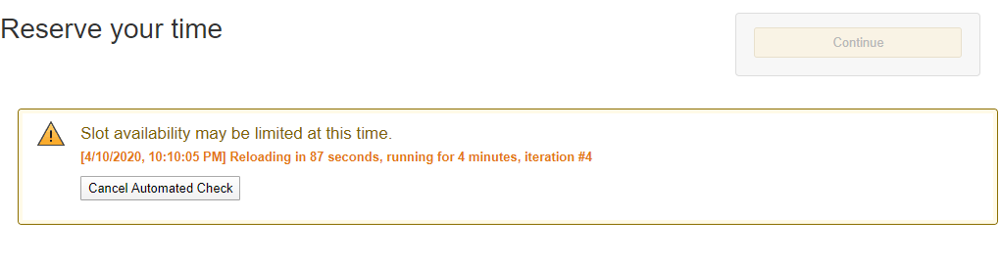

# amazon-slot-machine
Automate finding an available delivery slot for Amazon Fresh &amp; Whole Foods

### Installation
1. Install the [Tampermonkey extension](https://www.tampermonkey.net/) in your browser. I recommend using Chrome, but other modern browsers likely work.
2. [Click here](https://github.com/chahu/amazon-slot-machine/raw/master/Amazon%20Delivery%20Slot%20Machine.user.js) to install with Tampermonkey

3. Checkout like normal with your Amazon Fresh or Whole Foods order on amazon.com. On the delivery slots page you'll see a message from this script (screenshots below).

### Overview

If you're having trouble ordering groceries on Amazon Fresh (or Whole Foods) on amazon.com, this may help.
When you try to check out and get to the page with no delivery slots available and you installed this script,
you should see a message asking if you'd like to start the automated check for a delivery slot.

At this point you have the option of entering your login and password. If you do not this will still work 
until amazon requires logging in again (2 hours from what I can tell). At that point you'll need to manually
start this again. When credentials are entered this code should continue running and relogin the user. In
either case click the start button to begin the automated process.

When one or more delivery slots are detected an alarm will sound repeatedly. At this point the user should 
quickly select an available slot and continue. The final steps of checkout are not automated.

### Features

- Minimal requirements (a modern browser with Tampermonkey). Works on at least Windows and Mac OSX.
- Simple integration: You'll see this on the delivery slot page: 
- Updated status message letting you know it is still running and some simple info: 
- Cancelling is also done with one click (above).
- When the process is started a single "coin" audio sound will play. This is the same sound that will play on repeat as an alarm later. Make sure you can hear this sound when you click start.
- Everything is local, no data is sent anywhere in connection with this code outside of the obvious interaction with amazon pages.
- The (optionally) stored login & pass are only stored for the duration of the automated check process, afterwhich time they are deleted. We do not store these credentials more than absolutely necessary. When run without the user credentials, you should get about two hours of automated checking from this code.

### Tips

- Keep your computer on. If your computer goes to sleep or shuts off this process will also stop.
- Keep your speakers on. You should you hear a sound play when you click "Start Automated Check". This is the same sound that will play on a loop as an alarm.
- To make sure you have installed this script successfully. Go to [amazon.com](https://www.amazon.com) and verify you can see the Tampermonkey icon with a red circle and number on it, like below:

- Once you find a delivery slot that works for you, select it quickly. You can then checkout immediately, or continue shopping and adding items. Amazon will reserve your spot for 60 minutes. It's possible some out-of-stock items were removed from your cart, so it doesn't hurt to check if you want to add anything last minute before checking out.

### Issues
- If you have both Amazon Fresh and Whole Foods items in your cart and when the script tries to log back in and checkout for you (after two hours), it will checkout with whichever is shown first in your shopping cart (Amazon Fresh). I'm not convinced this is worth addressing.
- Testing; I have tested this on Chrome (Windows 10) and reports that it works on Mac.
- Please submit Issues/bugs to help improve this. Provide the URL where something went wrong and possibly a screenshot or description of what you see. Optionally provide information from the console log, if you know what that is.
